# Nexus

Nexus is a next-generation, high-performance, open-source hyperconverged infrastructure (HCI) platform. Branching from the harvester-nexus architecture and built on a rock-solid SLE Micro base, nexus breaks down the structural silos between traditional virtual machines, Kubernetes guest clusters, and high-efficiency system containers.

By unifying the bare-metal agility of Proxmox and Incus (LXC) with the massive cloud-native orchestration of Kubernetes (KubeVirt) and VMware vSphere class enterprise storage/scheduling, nexus represents the ultimate consolidation of computing, storage, and specialized hardware accelerators, including a HUD interface, wizard-driven machine provisioning, Kubernetes manifest generation, storage backend provisioning, and multi-cluster deployment workflows.

> **Version 2.0** lands the features described in [`UPDATED.md`](./UPDATED.md): the Poly-Compute Engine, the Universal Storage Fabric (now including Vitastor with SPDK bypass), hyper-efficient data path acceleration (SPDK / DPDK / vhost-user / NUMA pinning / 1 GiB hugepages), advanced acceleration (GPU + FPGA + smart-NIC pass-through, nested virtualization for AI / ML), **and a built-in 100% open-source XDR / MDR platform** that detects, attributes, and auto-responds to threats across every host, VM, container, pod, and edge endpoint. See the [Nexus 2.0 release](#nexus-20-release) section.

## Nexus 2.0 release

Highlights:

- **Poly-Compute Engine** — runs KubeVirt VMs, Incus / LXC system containers, and native Kubernetes pods on the same bare-metal loop, with NUMA-local DRAM affinity, 1 GiB hugepages for KubeVirt, nested-virt opt-in pools, and cross-socket cost penalties on the scheduler.
- **Universal Storage Fabric** — every storage backend in the catalog is wired into CSI / direct-host paths, including **Vitastor** with SPDK userspace queues, NVMe-oF / RDMA with userspace bypass, ZFS with copy-on-write + zstd + ARC cache, **AnyRAID** with heterogeneous-capacity drive slabbing, iSCSI multipath via `vfio-pci`, and NFS / SMB through the subpath driver for RWX shares.
- **Hardware acceleration** — SPDK userspace NVMe-oF queues, DPDK polled-mode rings, vhost-user fast paths, NUMA pinning with 1 GiB hugepages, GPU / FPGA / smart-NIC / TPU pass-through (vfio-pci / SR-IOV / mdev), and L1 nested virtualization for training, inference, sandbox, and CI pools.
- **Machine Wizard 2.0** — install YAML with `poly_compute` and `hardware_acceleration` blocks plus boot-parameter switches (`nexus.poly_compute=kubevirt,incus,pods`, `nexus.acceleration.spdk=true`, `nexus.acceleration.hugepages_1g=64`, `nexus.acceleration.gpu_passthrough=true`). Validation refuses configs that turn off every runtime or enable GPU pass-through without NUMA pinning.
- **Built-in XDR / MDR platform (100% FOSS)** — every Nexus install ships with a complete detect-and-respond stack: 17 open-source sensors (Falco, Tetragon, Wazuh, Trivy, Grype, Syft, Suricata, Hubble, OpenSearch, MISP, kube-bench, kube-hunter, Polaris, OpenCanary, OpenSCAP, Lynis), 10 free threat-intel feeds (MISP, OTX, ThreatFox, URLhaus, Feodotracker, ETOpen, MITRE ATT&CK, NVD, OSV, internal allowlist), 18 Sigma-style detection rules covering all seven MITRE ATT&CK kill-chain phases, 10 automated response actions that emit real Kubernetes manifests (Cilium NetworkPolicy isolate, Harvester host cordon/drain, KubeVirt `VirtualMachineSnapshot`, Incus snapshot, Tetragon `TracingPolicy` SIGKILL, ArgoCD rollback, Trivy image block, Cilium CCNP egress-domain block), and APT geo-attribution that maps sources to actors like APT28 / LAZARUS. No paid SKUs, no subscriptions.
- **Themable cockpit** — four cool-tone switchable themes (Route Grid, Arctic Hologram, Arctic Command, Ice Spectrum). Theme selection persists in `localStorage`.

## Overview

Nexus is the updated Harvester fork with:

- **Universal storage fabric** — iSCSI, GlusterFS, Longhorn, OpenEBS, Portworx, NVMe-oF, RDMA, Ceph, ZFS, **AnyRAID** (heterogeneous-capacity drives in a single slab-based pool), NFS, SMB, Vitastor, and local-path storage with CSI templates per backend.
- **Network fabric and service mesh** — Istio, Linkerd, Cilium, plus Service, Ingress, and NetworkPolicy generation.
- **Built-in XDR / MDR detect-and-respond** — eBPF runtime security, HIDS, IDS/IPS, image-scan admission, K8s benchmark, host hardening, threat intel, honeypots, and automated response actions, all driven by 100% FOSS components.
- **Identity, RBAC, and policy** — RBAC roles, Pod Security Standards enforcement, service accounts, workload annotations, and admission-time best-practice gating (Polaris).
- **Observability templates** — Prometheus monitoring, Fluentd / Loki / Splunk logging, with the in-cockpit telemetry dashboards driven by a 1.6 s live tick.
- **GitOps and multi-cluster** — ArgoCD, Flux, Jenkins X integration manifests; federated deployment templates; `vcluster` virtual-cluster operations.

## Features

### Cockpit & visualization
- **Mission Control** — single-pane situational awareness for the entire cluster: KPI roll-ups, multi-ring cluster posture, four-channel telemetry traces, dial clusters per fast-path lane, vertical level meters per node, ring meters per storage backend, anomaly streaming, a 3D isometric cluster topology, live event log, node-by-hour activity heatmap, workload activity timeline, 12-channel sparkline grid, GitOps sync bank, GPU memory grid, API-rate gauges, stacked area charts, sankey flow, percentile bands, FFT spectrum, and dense stat grids — every widget driven by the live telemetry tick.
- **Telemetry Wave** — deep-dive performance scope for SPDK / DPDK / vhost-user / RDMA fast paths with per-channel `MIN / AVG / MAX / NOW` readouts, 64-bin FFT spectrum with peak hold, and rolling latency histograms with `MEAN / P50 / P95 / P99` callouts.
- **Networking dashboard** — geographic threat-intelligence map (the "Threat-Intel Map" hero widget) that visualises which countries are sourcing traffic to the cluster and which are actively attacking it, with live IP / host / method / status / RPS / bytes overlays per active source, a rail of active APT actor + CVE + malware + MITRE ATT&CK tactic attributions, a live XDR stat strip (DEFCON, alerts/min, blocked 24h, escalated, isolated, IOC count, MTTD / MTTR, active APTs, critical CVEs), and a MITRE kill-chain strip with per-phase threat counts. Paired with a sonar-style **Cluster Radar** for east-west traffic, tier roll-ups, top talkers, and flagged nodes.
- **Environment Intelligence** and **Activity Command** — facility telemetry, automation queues, approval flows, in-flight migrations, backup status, and security-scan activity.
- **Live Environment Ticker** — rolling cluster-wide stats (workloads, IOPS, ingress / egress Mb/s, CPU %, DRAM %, power, in-flight migrations, open CVEs, trust score) pinned above every dashboard.
- **Four cool-tone cockpit themes** (Route Grid, Arctic Hologram, Arctic Command, Ice Spectrum) with persistent `localStorage` selection.
- **Eight additional themed data dashboards**: Networking, Storage, Machines & Containers, Processor & Memory, Poly-Compute Engine, Acceleration, Operations & Compliance, Resource Monitoring.

### Security · Detection &amp; response (XDR / MDR)
- **Endpoint coverage** — every host, KubeVirt VM, Incus / LXC container, Docker container, Kubernetes pod, edge node, and third-party integration is enrolled and inventoried.
- **Sensor stack (17 FOSS components)** — eBPF runtime security (**Falco**, **Tetragon**), HIDS + SIEM (**Wazuh Agent** + **Wazuh Manager** + **OpenSearch** event lake), IDS / IPS (**Suricata** with ETOpen rules), container-image and SBOM scanning (**Trivy**, **Grype**, **Syft**), Kubernetes admission control (**Trivy operator**, **Polaris**), Kubernetes benchmark and pen-test (**kube-bench**, **kube-hunter**), host hardening (**OpenSCAP**, **Lynis**), L4/L7 flow telemetry (**Hubble**), threat-intel platform (**MISP**), deception (**OpenCanary**).
- **Threat intelligence (10 free feeds)** — MISP, AlienVault OTX, abuse.ch ThreatFox / URLhaus / Feodotracker, Emerging Threats Open, MITRE ATT&CK, NVD, OSV, and an internal allowlist; indicators (IPs, domains, hashes, CVEs) are indexed for O(1) matching on every event.
- **Detection rules (18 Sigma-style)** — coverage across all seven MITRE ATT&CK kill-chain phases: reconnaissance, initial access, execution, persistence, privilege escalation, defense evasion, credential access, lateral movement, command-and-control, exfiltration, and impact (including ransomware syscall pattern, honeypot interaction, known-bad hash exec, known C2 IP/domain, anomalous east-west drops, shadow-file read, and large egress bursts).
- **Automated response (10 action types)** — every action emits real Kubernetes YAML: Cilium `NetworkPolicy` endpoint isolation, Harvester host cordon + drain, KubeVirt `VirtualMachineSnapshot`, Incus snapshot, Tetragon `TracingPolicy` SIGKILL, ArgoCD rollback to a known-good revision, Trivy image-block admission rule, Cilium `ClusterwideCiliumNetworkPolicy` egress-domain block, token rotation, and alert-only.
- **APT attribution** — source IPs are geo-mapped and correlated with the indicator catalog to attribute alerts to actors such as APT28 / Fancy Bear, LAZARUS, and others, complete with country, city, CVE, malware hash, and MITRE tactic.
- **XDR Operations Center** — live SOC dashboard with KPI roll-ups (alerts/min, blocked 24h, isolated hosts, active APTs), endpoint inventory with sensor coverage, recent alerts with IOC details, auto-dispatched response actions, MITRE ATT&CK kill-chain heatmap that lights up as tactics get hit, threat attribution panel, and sensor health grid. Powered by an in-app `XdrEngine` and a deterministic 14-step attack-scenario simulator for demos.
- **Security Posture wizard** — three presets (Baseline, Hardened, Maximum), per-sensor opt-in for add-ons, live previews of generated Kubernetes manifests (`DaemonSet`, `Deployment`, `Service`, `CronJob`, `ValidatingWebhookConfiguration`), and a one-liner `kubectl apply` to stand the entire stack up.
- **Rolling SLA metrics** — MTTD and MTTR are computed from the engine's detection and response latencies, exposed on every snapshot.

### Wizards & workflows
- In-tree Harvester platform source under `platform/harvester` so Nexus is tracked as a standalone system instead of a UI-only add-on.
- Nexus new-machine wizard for Harvester create/join/binaries install flows with generated automatic install configuration.
- Manifest Wizard embedded inside the unified Setup Wizard as an optional setup section, allowing workload manifest generation without leaving the provisioning flow.
- Wizard-driven workload and manifest configuration.
- Storage selection for local, NFS, SMB, Ceph, NVMe-oF, RDMA, ZFS, **AnyRAID**, iSCSI, GlusterFS, Longhorn, OpenEBS, Portworx, and Vitastor (with SPDK userspace bypass). The AnyRAID wizard step accepts heterogeneous drive capacities, computes the effective usable capacity from a slab-based redundancy plan, and renders a `StorageClass` whose parameters carry the per-disk inventory through to the CSI driver.
- Auto-generated `Deployment`, `StatefulSet`, `DaemonSet`, `Job`, and `CronJob` manifests.
- PVC, Service, Ingress, NetworkPolicy, RBAC, monitoring, logging, GitOps, and multi-cluster manifest generation.
- Service mesh integration support for Istio, Linkerd, and Cilium.

### Editor & integration
- CodeMirror YAML editor preview with live validation and dark-mode styling.
- Live-adapter operation planning for Kubernetes API validation, `kubectl` apply/test runs, `vcluster` workflows, and CSI templates sourced from the imported Harvester tree.
- Kubernetes validation and live preview combining local structural prechecks with Nexus live-adapter endpoints and server-side dry-run command generation.
- Manifest apply / test runner commands generated for `kubectl auth can-i`, server-side dry-run, diff, apply, and rollout status.
- Virtual-cluster support generating `vcluster` create/connect operations from multi-cluster targets.
- Storage backend templates that include CSI StorageClass, VolumeSnapshotClass, PVC manifests, and Harvester chart references under `platform/harvester/deploy/charts/harvester`.

## Screenshots

A tour of the live cockpit. Every screen below is captured from the running
[Vite dev server](#installation) on the current branch.
The captions describe what each surface **does**, not how it's laid out.

### Mission Control

Single-pane situational awareness for the entire HCI cluster. Aggregates
posture, throughput, latency, anomalies, GitOps sync state, GPU memory
pressure, API request rates, storage IOPS, and node-level activity into one
view so on-call can triage the platform without bouncing between tools.

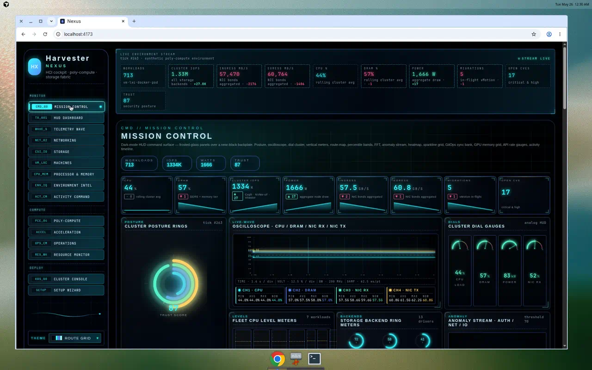

### Telemetry Wave

Deep-dive performance scope for the data-plane fast paths
(SPDK / DPDK / vhost-user / RDMA). Surfaces per-channel min/avg/max/now
throughput, FFT spectral content for jitter and periodic interference, and
end-to-end latency distributions with `MEAN / P50 / P95 / P99` percentiles
so you can isolate which fast path is degrading.

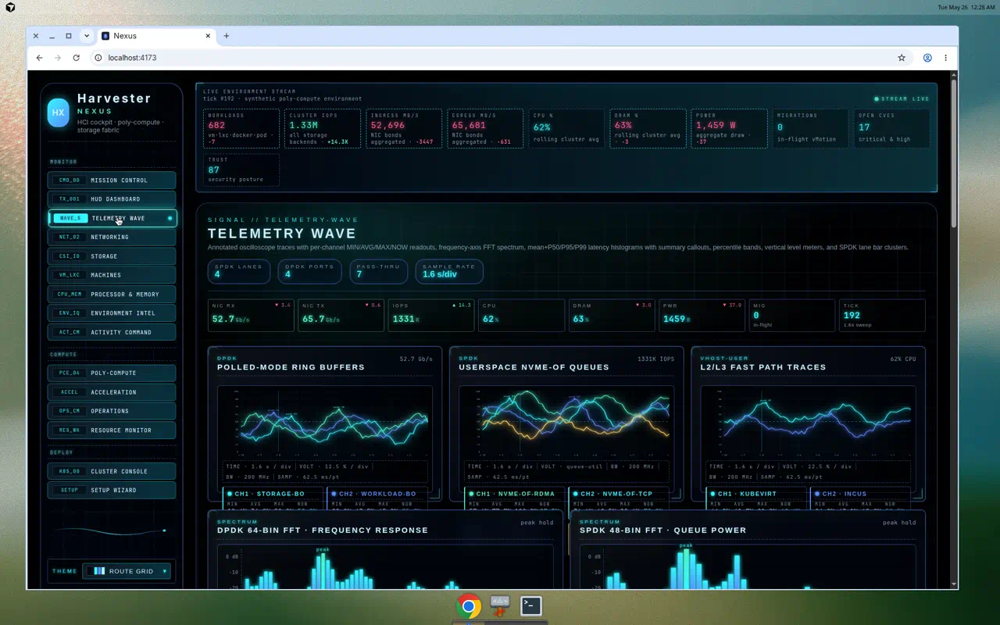

### Networking · Threat-Intelligence Map

Geographic threat-intel overlay that visualises which countries are
sourcing traffic to the cluster and which are actively attacking it,
attributes each active source to an APT actor / CVE / malware family /
MITRE ATT&CK tactic, surfaces live XDR roll-ups (DEFCON, alerts/min,
blocked 24h, escalated, isolated, IOC count, MTTD / MTTR, active APT
count, critical CVE count), and tracks per-phase threat counts across the
full MITRE kill chain.

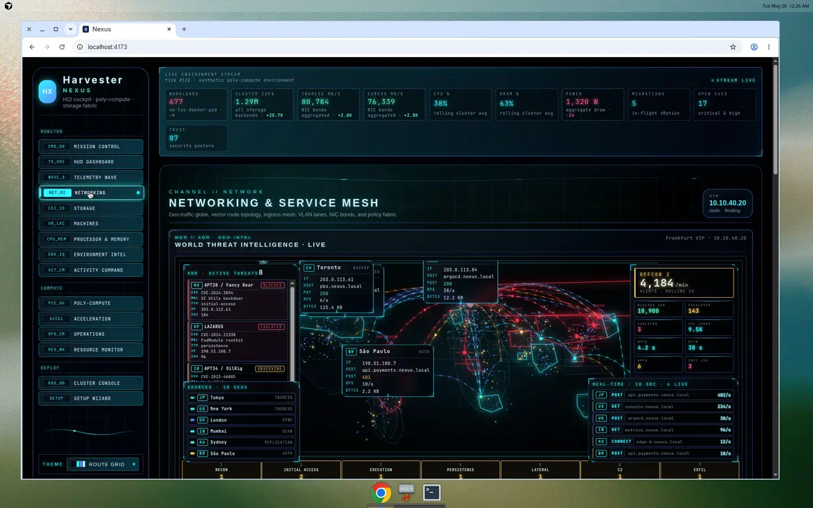

### Storage dashboard

Unified view of every storage backend Nexus speaks (Ceph, Longhorn,
NVMe-oF, RDMA, ZFS, **AnyRAID**, Vitastor, iSCSI, NFS, SMB, GlusterFS,
OpenEBS, Portworx, local path), with per-backend capacity, IOPS, and
read/write breakdowns so the operator sees the whole fabric at once.

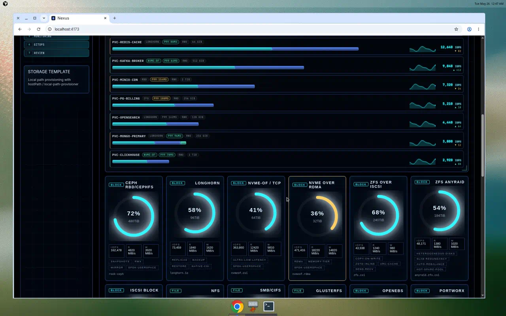

### Setup Wizard

End-to-end provisioning — bare-metal install plan (create / join /
binaries) and Kubernetes workload manifest generation in the same flow.
Lets you stand up a Harvester host and the workloads that target it
without leaving the wizard.

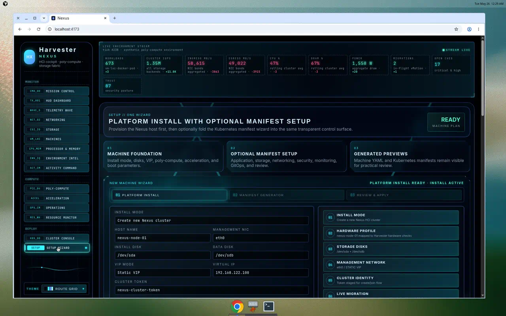

### AnyRAID configuration

Accepts a heterogeneous-capacity drive inventory and produces a single
slab-based ZFS pool, computing effective usable capacity and emitting a
`StorageClass` whose CSI parameters carry the per-disk plan through to
the driver. Lets operators reuse mixed older + newer drives instead of
forcing matched sets.

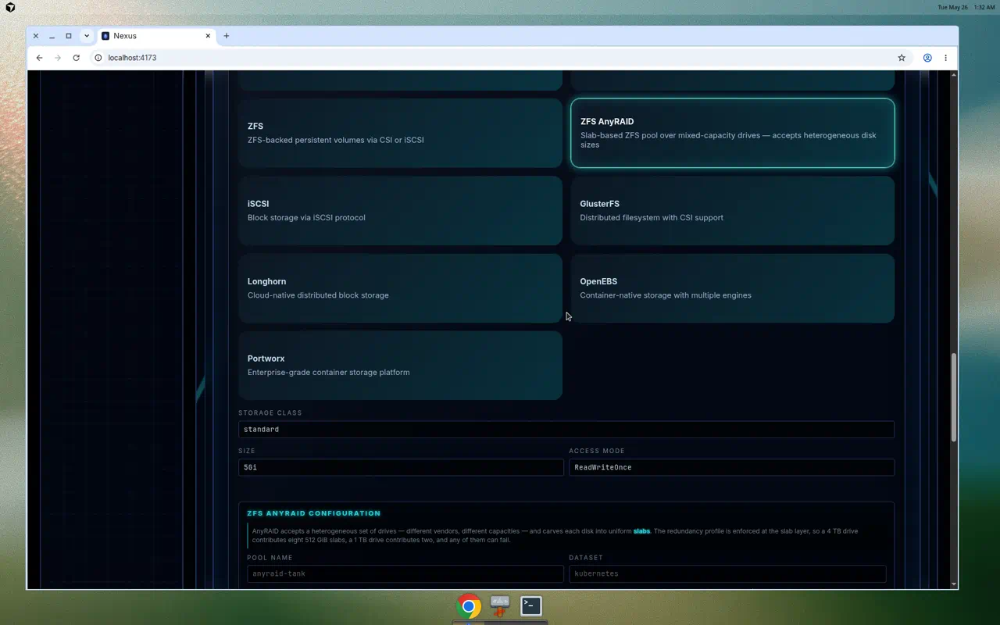

### Manifest Wizard · workload types

Generates production-ready manifests for all five core Kubernetes
workload kinds (`Deployment`, `StatefulSet`, `DaemonSet`, `Job`,
`CronJob`) along with the supporting `PVC`, `Service`, `Ingress`,
`NetworkPolicy`, RBAC, and monitoring resources for the chosen workload.

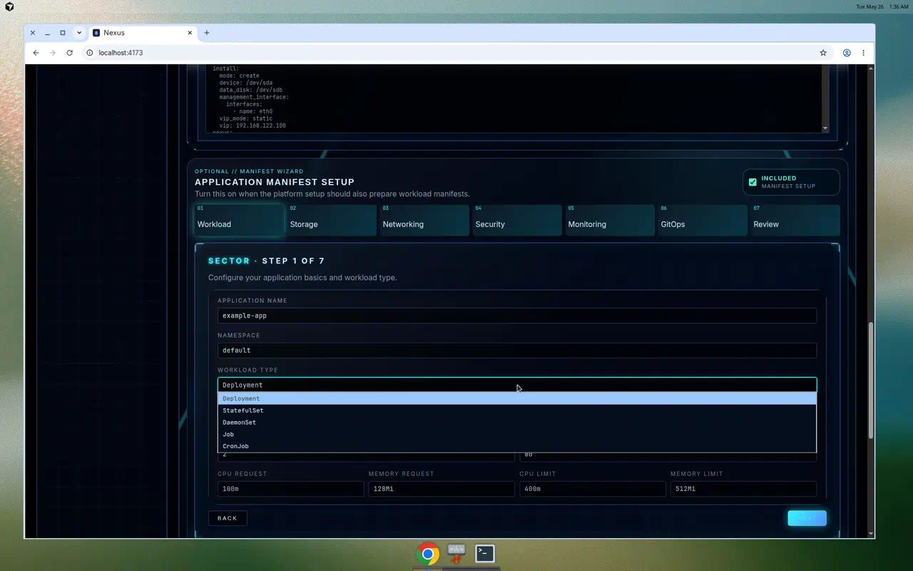

### Generated Kubernetes manifest

Live YAML editor with structural validation — edits update the validation
status inline and feed straight into the Cluster Console's dry-run / apply
/ rollout commands, so the manifest you see is the manifest you ship.

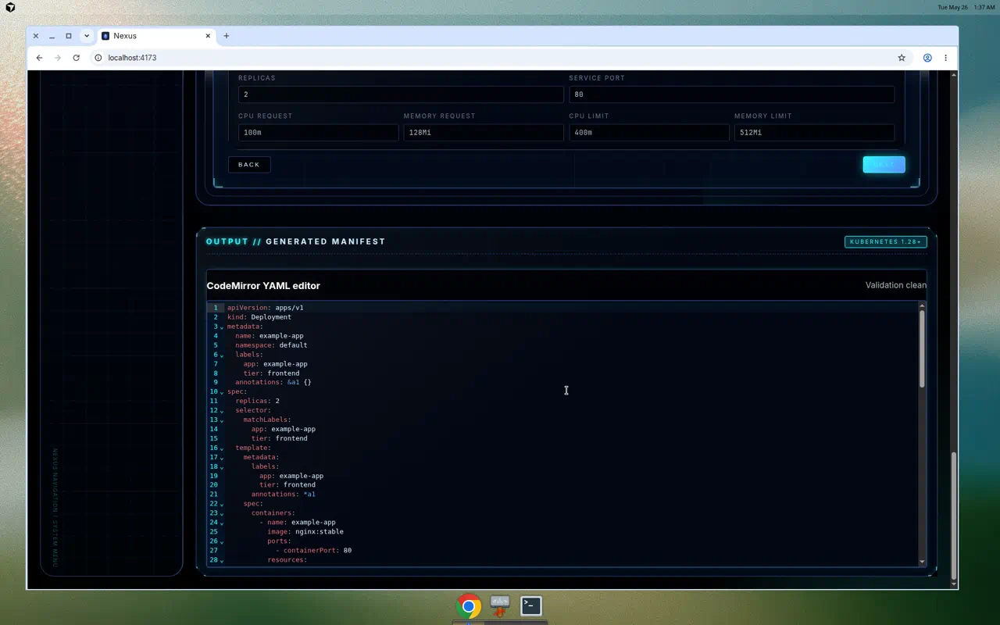

### Cluster Console

The integration surface between the cockpit and a real cluster: Kubernetes
API validation, `kubectl auth can-i` / server-side dry-run / diff / apply
/ rollout-status command generation, `vcluster` multi-cluster operations,
and provisioner-specific CSI storage templates.

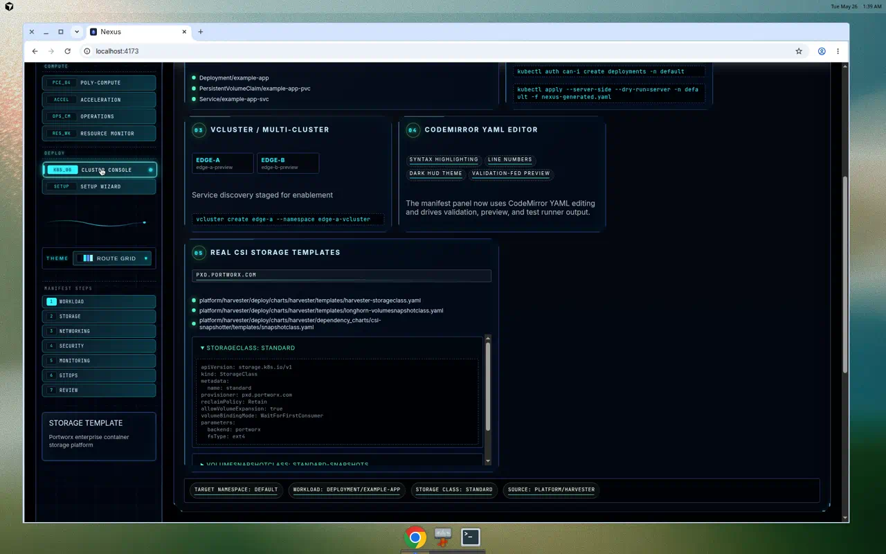

### XDR Operations Center

Live security operations dashboard powered by the in-app `XdrEngine`.
Inventories every endpoint, streams real-time alerts with matched IOC
details, auto-dispatches Kubernetes response actions, tracks MITRE
ATT&CK kill-chain coverage per tactic, and attributes attacks to named
APT actors. A deterministic 14-step attack-scenario simulator drives the
view in demo / preview mode.

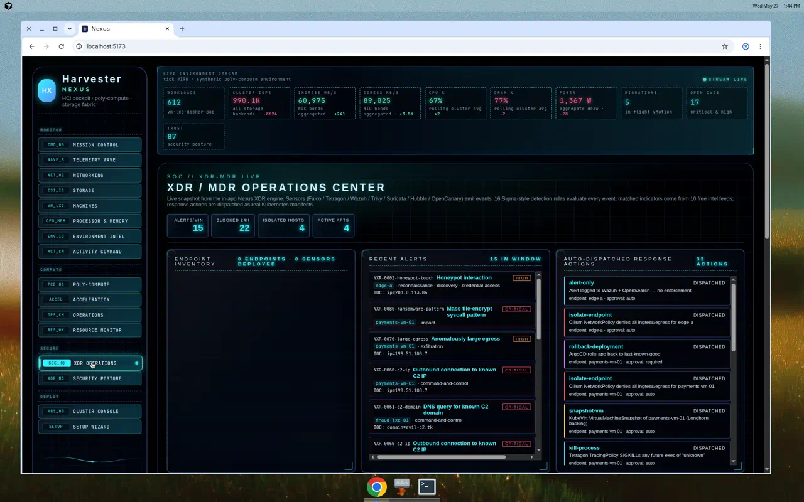

### MITRE ATT&CK kill-chain + APT attribution

Kill-chain heatmap that highlights every tactic an attacker has touched
(reconnaissance → impact) plus a threat-attribution panel that names the
actor (APT28 / Fancy Bear, LAZARUS, etc.), their origin country and city,
the CVE they exploited, the malware family, and the recommended response
action. Drives faster triage by replacing raw alert noise with
analyst-ready context.

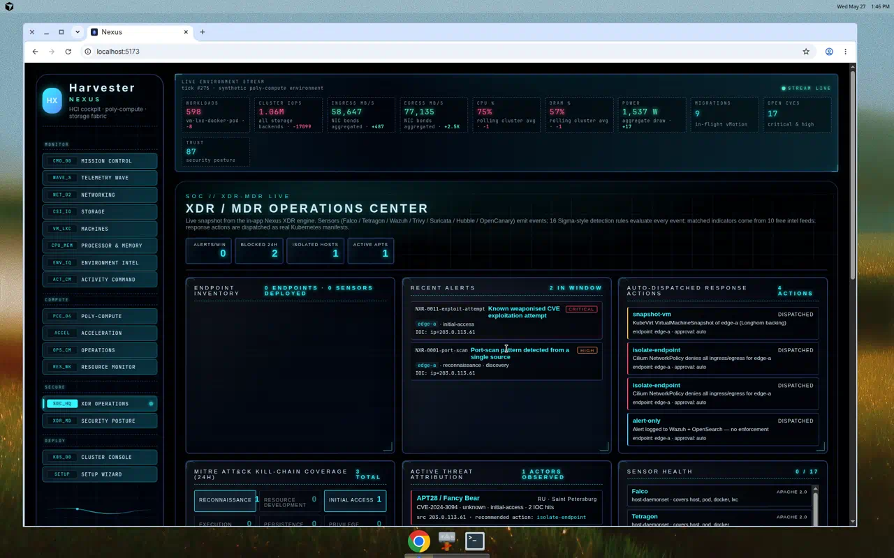

### Security Posture wizard

Picks an XDR profile (Baseline / Hardened / Maximum) and tunes the sensor
stack. Surfaces every one of the 17 FOSS sensors with vendor, license,
version, placement, covered endpoint kinds, and homepage so operators
can audit the supply chain before standing the platform up. The wizard
emits the full Kubernetes bundle (DaemonSets, Deployments, Services,
CronJobs, admission webhooks) ready to `kubectl apply`.

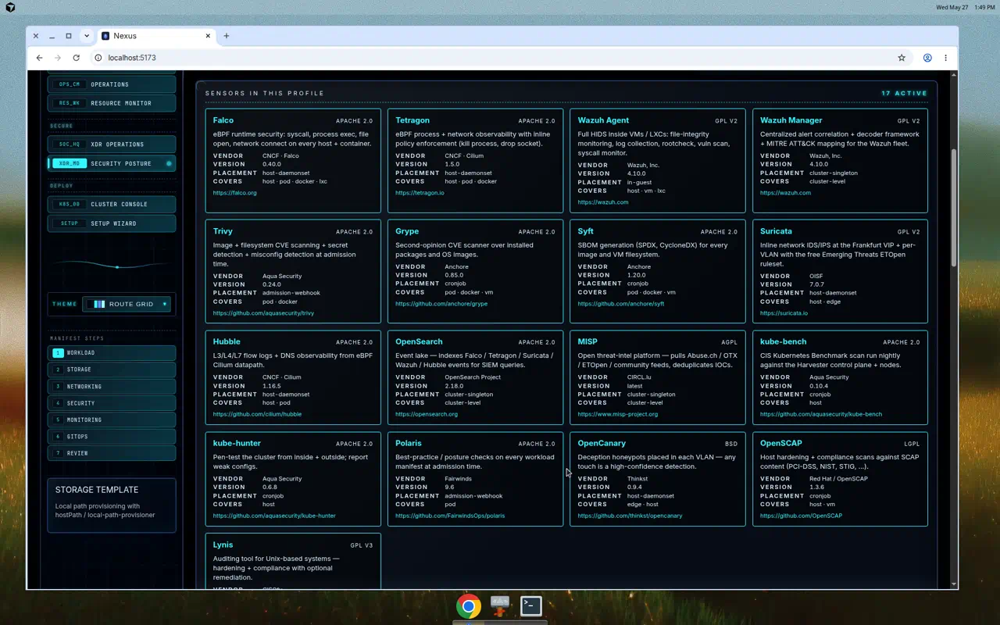

### XDR · Generated Kubernetes manifest

The actual YAML the wizard emits — real upstream FOSS images
(`falcosecurity/falco`, `cilium/tetragon`, `wazuh/wazuh-agent`,
`aquasecurity/trivy-operator`, `jasonish/suricata`,
`opensearchproject/opensearch`, …), correct privilege scopes, host
mounts where eBPF needs them, and a namespace + apply commands. Nothing
behind it is proprietary.

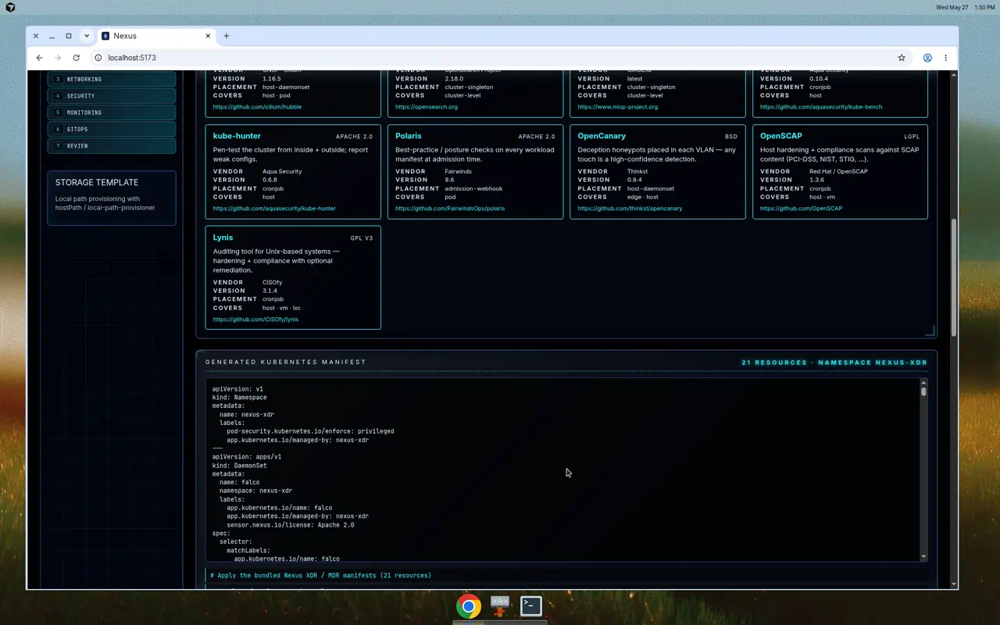

### Detection rule catalog

All 18 Sigma-style detection rules: their MITRE technique IDs, the
tactics they cover, the sensors they require, the severity they emit,
and the response actions they recommend. The catalog is the source of
truth — the engine evaluates exactly these rules against every sensor
event.

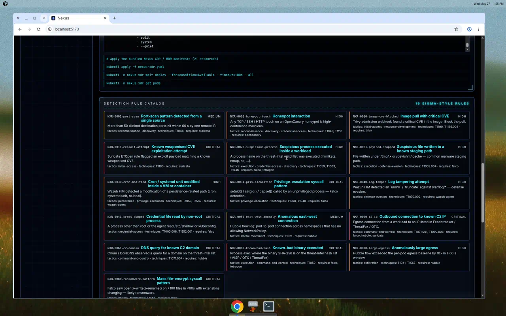

### Sidebar navigation

Grouped cockpit nav (`MONITOR`, `COMPUTE`, `SECURE`, `DEPLOY`) that lets
operators jump between observability, compute / scheduling, security
operations, and provisioning without losing context. The new `SECURE`
group hosts the XDR Operations Center and Security Posture wizard.

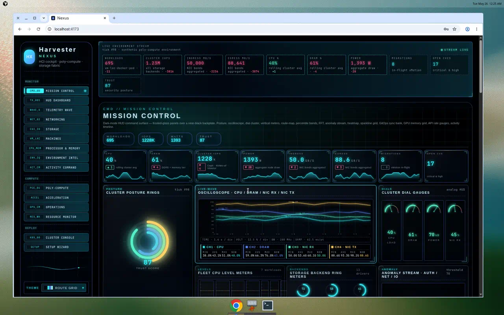

### Theme picker

Four cool-tone themes (Route Grid, Arctic Hologram, Arctic Command, Ice
Spectrum) so the cockpit adapts to operator preference and ambient
lighting in the SOC. Theme selection persists in `localStorage`.

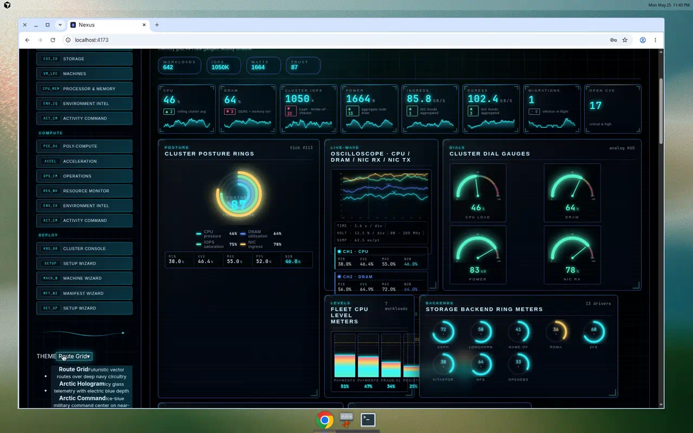

## Installation

The Nexus cockpit ships as a React + TypeScript single-page app built with Vite. The instructions below get you from a clean Ubuntu 22.04 / 24.04 box to a running Nexus dev server on `http://localhost:4173`.

### Hardware requirements

Two profiles apply: the **cockpit** (the React app you install via the steps in this section, which configures and orchestrates the platform) and the **Nexus platform** itself (the bare-metal HCI host or cluster that the cockpit ultimately provisions and protects with the bundled XDR / MDR stack).

#### Cockpit (dev / preview host)

| Resource | Minimum | Optimal |
|---|---|---|
| CPU | 2 cores, x86_64 or arm64 | 4+ cores |
| Memory | 4 GB RAM | 8 GB RAM |
| Disk | 2 GB free (≈ 500 MB `node_modules`, 50 MB build output, headroom for Playwright / Chromium) | 10 GB free on SSD/NVMe |
| OS | Ubuntu 22.04 / 24.04 (any modern Linux works) | Ubuntu 24.04 LTS |
| Network | Outbound HTTPS to npm registry + GitHub for `npm install` and `git clone` | Same |
| Browser | Chromium / Firefox / Safari with ES2020 + `backdrop-filter` support | Chromium-based browser at 1920×1080 or wider for the full HUD layout |

#### Nexus platform — single-node lab

A single host running the bundled Harvester base + Kubernetes + KubeVirt + XDR sensors. Suitable for development, proofs-of-concept, and small edge deployments.

| Resource | Minimum | Optimal |
|---|---|---|
| CPU | 8 cores, x86_64 with VT-x / AMD-V, SSE4.2, `xsave` | 16+ cores with AVX2, IOMMU enabled (VT-d / AMD-Vi) for SR-IOV and GPU pass-through |
| Memory | 32 GB RAM | 64+ GB RAM with at least one NUMA node free for 1 GiB hugepages |
| Boot disk | 200 GB SSD | 500 GB NVMe |
| Data disks | 1× 500 GB SSD for ZFS / Longhorn / OpenEBS | 2+ NVMe drives for the storage fabric (AnyRAID accepts heterogeneous capacities) |
| Network | 1× 1 GbE | 1× 10 GbE + 1× 25 GbE for storage / east-west, or RDMA-capable NIC for the NVMe-oF fast path |
| Accelerators | none | optional GPU / FPGA / smart-NIC with vfio-pci binding for AI/ML and SmartNIC offload pools |
| Firmware | UEFI with secure boot **off** (KubeVirt + eBPF require unsigned kernel modules in some kernels) | UEFI + TPM 2.0 for Wazuh FIM and OpenSCAP host hardening evidence |

#### Nexus platform — production HCI cluster

A 3+ node hyperconverged cluster running the full Poly-Compute Engine (KubeVirt VMs + Incus / LXC + pods on every node), the Universal Storage Fabric, and every XDR sensor in the **Maximum** Security Posture profile.

| Resource | Minimum (per node) | Optimal (per node) |
|---|---|---|
| Nodes | 3 control-plane + worker (hyperconverged) | 5+ nodes with separate control-plane and worker classes for blast-radius isolation |
| CPU | 16 cores with VT-x/AMD-V, VT-d/AMD-Vi, AVX2 | 32+ cores, dual-socket, NUMA-aware |
| Memory | 64 GB RAM with 8 GB reserved for hugepages | 256+ GB RAM with 64 GB reserved for 1 GiB hugepages, one socket-local pool per workload class |
| Boot disk | 200 GB NVMe (mirrored) | 2× 500 GB NVMe in mirror |
| Storage tier | 2× 1 TB NVMe per node for the hot tier, 4× 4 TB SATA SSD for the warm tier | 4+ NVMe per node bound to SPDK userspace queues, plus a slower SATA SSD / HDD warm tier; AnyRAID handles mixed capacities |
| Network — front | 2× 10 GbE (LACP) for north-south | 2× 25 GbE (LACP) for north-south |
| Network — fabric | 2× 25 GbE for east-west and storage replication | 2× 100 GbE RDMA (RoCEv2) for east-west, storage replication, and the NVMe-oF target plane |
| Accelerators | none required | GPU pool (NVIDIA / AMD), FPGA pool (Xilinx / Intel), smart-NIC pool (BlueField / Stingray) all bound via vfio-pci / SR-IOV / mdev |
| Firmware | UEFI, IOMMU on | UEFI + TPM 2.0 + measured boot; firmware managed via Lifecycle Controller / iLO / iDRAC / Redfish |
| Power / cooling | redundant PSU per node | redundant PSU, hot-aisle containment, environmental telemetry exposed to the Environment Intelligence dashboard |

#### XDR / MDR sensor overhead (cluster-wide, all 17 sensors in Maximum profile)

| Resource | Minimum | Optimal |
|---|---|---|
| CPU | 4 cores total | 8+ cores total, headroom for OpenSearch indexing under burst |
| Memory | 8 GB RAM total (OpenSearch + Wazuh Manager + MISP) | 24+ GB RAM total — OpenSearch heap 4 GB, Wazuh Manager 4 GB, MISP + ThreatFox replica 4 GB, the rest distributed across host DaemonSets |
| Disk | 100 GB for the event lake (≈ 30 days at low event rate) | 1+ TB NVMe for the OpenSearch event lake (≥ 90 days hot retention, plus warm-tier archive for compliance evidence) |

> The cockpit will start and run on the **Cockpit minimum**. The Nexus platform requirements only apply when you actually deploy the manifests the cockpit generates onto real hardware.

### 1. System prerequisites

```bash
sudo apt update
sudo apt install -y git curl build-essential ca-certificates
```

### 2. Install Node.js 20.x

The project requires **Node.js ≥ 20** (matches `vite@5` and `vitest@4`). Use one of these:

**Option A — nvm (recommended for development):**

```bash
curl -o- https://raw.githubusercontent.com/nvm-sh/nvm/v0.40.1/install.sh | bash
export NVM_DIR="$HOME/.nvm"
[ -s "$NVM_DIR/nvm.sh" ] && \. "$NVM_DIR/nvm.sh"
nvm install 20
nvm use 20
```

**Option B — NodeSource APT (system install):**

```bash
curl -fsSL https://deb.nodesource.com/setup_20.x | sudo -E bash -
sudo apt install -y nodejs
```

Confirm the install:

```bash
node --version   # v20.x or higher
npm --version    # 10.x or higher
```

### 3. Clone the repository

```bash
git clone https://github.com/sggr57a/harvester-nexus.git
cd harvester-nexus
```

> To run the bleeding-edge XDR / MDR branch instead of `main`, check it out:
> `git checkout cursor/xdr-mdr-foss-d3bc`

### 4. Install JavaScript dependencies

```bash
npm install
```

This installs React, Vite, CodeMirror, Vitest, TypeScript, and the rest of the toolchain (~280 packages).

### 5. Run the dev server

```bash
npm run dev
```

Open `http://localhost:4173` in any browser. **Demo credentials**: `admin` / `demo`.

> The dev server binds to port **4173** (not the default Vite 5173) — see `vite.config.ts`.

### 6. Verify the build

```bash
npx tsc --noEmit     # type-check the project
npm run test         # run the Vitest suite (178 tests)
npm run build        # production build into ./dist
npm run preview      # preview the production bundle on :4173
```

### 7. Optional — Playwright capture scripts

The `scripts/` folder contains optional Playwright-based mockup-capture scripts (`smoke-shot.mjs`, `record-mockups.mjs`, `capture.mjs`, `capture-login.mjs`). Install Chromium for Playwright before first use:

```bash
npx playwright install chromium
node scripts/capture.mjs
```

### 8. Optional — run inside Docker

If you'd rather not install Node on the host:

```bash
docker run --rm -it -p 4173:4173 -v "$PWD":/app -w /app node:20-bookworm \
  bash -c "npm install && npm run dev -- --host 0.0.0.0"
```

Open `http://localhost:4173` from your host browser.

### Repository layout

```
src/                          React + TypeScript source
  App.tsx                     Top-level shell + cockpit nav
  lib/themes.ts               4-theme catalog
  lib/liveTelemetry.ts        1.6 s live tick hook
  components/                 Login, launch, theme picker, wizards
  components/dashboards/      MissionControl, TelemetryWave,
                              Dashboards, Widgets (KpiTile,
                              DialGauge, AnnotatedOscilloscope,
                              ThreatIntelMap, ClusterRadar, …)
  styles.css                  Single-file CSS with all theme tokens
platform/harvester/           In-tree Harvester platform source
                              (Go; not built by the frontend demo)
scripts/                      Optional Playwright capture scripts
docs/mockups/                 Reference screenshots & videos
```

## Verified build

- `npx tsc --noEmit` — clean type-check
- `npm run test` — 178 / 178 Vitest tests pass (cockpit + XDR engine + rules + responses + manifests)
- `npm run build` — production bundle succeeds

## GitHub branches and pull requests

- Default branch (everything merged): <https://github.com/sggr57a/harvester-nexus/tree/main>
- XDR / MDR platform: PR <https://github.com/sggr57a/harvester-nexus/pull/27> (merged)
- Themed cockpit + AnyRAID: branch <https://github.com/sggr57a/harvester-nexus/tree/cursor/multi-theme-live-mockup-d3bc>
- Harvester platform fork: branch <https://github.com/sggr57a/harvester/tree/nexus>, PR <https://github.com/sggr57a/harvester/pull/1>
